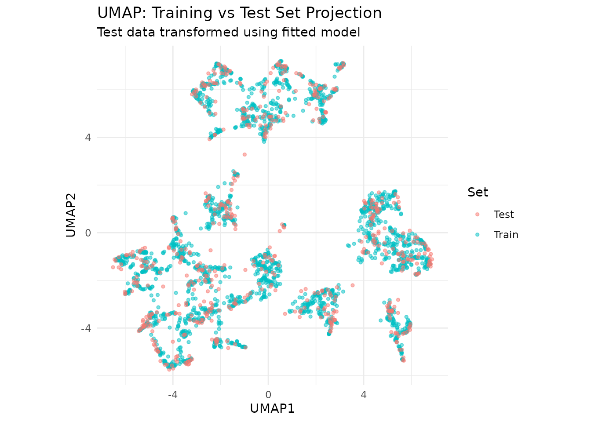

# Dimensionality Reduction for Encoded Categorical Data with uwotlite

This vignette demonstrates how to use `uwotlite` for dimensionality
reduction, complementing the categorical encoding approaches from
[Chapter 17 of Tidy Modeling with R](https://www.tmwr.org/categorical).

While Chapter 17 focuses on encoding categorical variables, `uwotlite`
provides UMAP (Uniform Manifold Approximation and Projection) for
reducing high-dimensional encoded data to visualizable or more
manageable dimensions.

## Setup

``` r
library(uwotlite)
library(dplyr)
library(ggplot2)
library(modeldata)

# Load the Ames housing data
data(ames)

# Create train/test split
set.seed(502)
n <- nrow(ames)
train_idx <- sample(seq_len(n), size = floor(0.8 * n))
ames_train <- ames[train_idx, ]
ames_test <- ames[-train_idx, ]
```

## The Use Case: Visualizing After Categorical Encoding

After encoding categorical variables (as shown in the embedmit
categorical encoding vignette), you may have many numeric features. UMAP
can reduce these to 2 dimensions for visualization or to a smaller
number of dimensions for modeling.

## Basic UMAP with uwotlite

First, let’s prepare a numeric dataset from the Ames data:

``` r
# Select and prepare numeric features
# In practice, you might first encode categoricals with embedmit
ames_numeric <- ames_train %>%
  select(
    Lot_Area, Gr_Liv_Area, Year_Built, Year_Remod_Add,
    Total_Bsmt_SF, First_Flr_SF, Second_Flr_SF,
    Full_Bath, Half_Bath, Bedroom_AbvGr, TotRms_AbvGrd,
    Fireplaces, Garage_Cars, Garage_Area,
    Wood_Deck_SF, Open_Porch_SF
  ) %>%
  # Handle missing values
  mutate(across(everything(), ~ifelse(is.na(.), median(., na.rm = TRUE), .))) %>%
  # Scale the features
  mutate(across(everything(), scale))

# Convert to matrix for uwotlite
ames_matrix <- as.matrix(ames_numeric)
```

## Running UMAP

The [`umap()`](https://rmsharp.github.io/uwotlite/reference/umap.md)
function performs dimensionality reduction:

``` r
set.seed(123)
ames_umap <- umap(
  ames_matrix,
  n_neighbors = 15,
  n_components = 2,
  metric = "euclidean",
  min_dist = 0.1,
  verbose = FALSE
)

# Combine with price for visualization
umap_df <- data.frame(
  UMAP1 = ames_umap[, 1],
  UMAP2 = ames_umap[, 2],
  Sale_Price = ames_train$Sale_Price,
  Neighborhood = ames_train$Neighborhood
)
```

## Visualizing the UMAP Embedding

``` r
ggplot(umap_df, aes(UMAP1, UMAP2, color = Sale_Price)) +
  geom_point(alpha = 0.6, size = 1) +
  scale_color_viridis_c(labels = scales::dollar) +
  labs(
    title = "UMAP Projection of Ames Housing Features",
    subtitle = "Colored by Sale Price",
    color = "Sale Price"
  ) +
  theme_minimal() +
  coord_fixed()
```


UMAP projection colored by Sale Price

``` r
# Show top 8 neighborhoods for clarity
top_neighborhoods <- ames_train %>%
  count(Neighborhood, sort = TRUE) %>%
  head(8) %>%
  pull(Neighborhood)

umap_df %>%
  filter(Neighborhood %in% top_neighborhoods) %>%
  ggplot(aes(UMAP1, UMAP2, color = Neighborhood)) +
  geom_point(alpha = 0.6, size = 1.5) +
  labs(
    title = "UMAP Projection by Neighborhood",
    subtitle = "Top 8 neighborhoods shown"
  ) +
  theme_minimal() +
  coord_fixed()
```


UMAP projection colored by Neighborhood

## Key UMAP Parameters

Understanding the main parameters helps tune UMAP for your use case:

``` r
set.seed(123)

# Compare different n_neighbors values
neighbor_values <- c(5, 15, 50)
umap_results <- lapply(neighbor_values, function(nn) {
  result <- umap(ames_matrix, n_neighbors = nn, n_components = 2,
                 min_dist = 0.1, verbose = FALSE)
  data.frame(
    UMAP1 = result[, 1],
    UMAP2 = result[, 2],
    Sale_Price = ames_train$Sale_Price,
    n_neighbors = paste("n_neighbors =", nn)
  )
})

bind_rows(umap_results) %>%
  ggplot(aes(UMAP1, UMAP2, color = Sale_Price)) +
  geom_point(alpha = 0.5, size = 0.8) +
  scale_color_viridis_c() +
  facet_wrap(~n_neighbors, scales = "free") +
  labs(title = "Effect of n_neighbors on UMAP Structure") +
  theme_minimal()
```


Effect of n_neighbors on UMAP embedding

| Parameter      | Effect                                                      |
|----------------|-------------------------------------------------------------|
| `n_neighbors`  | Higher = more global structure, lower = more local detail   |
| `min_dist`     | Higher = more spread out, lower = tighter clusters          |
| `n_components` | Number of output dimensions (2 for visualization)           |
| `metric`       | Distance measure (“euclidean”, “cosine”, “manhattan”, etc.) |

## Transforming New Data

A key feature of uwotlite is the ability to transform new data using a
fitted UMAP model:

``` r
# Fit UMAP with ret_model = TRUE to enable transformation
set.seed(123)
ames_umap_model <- umap(
  ames_matrix,
  n_neighbors = 15,
  n_components = 2,
  min_dist = 0.1,
  ret_model = TRUE,
  verbose = FALSE
)

# Prepare test data the same way
ames_test_numeric <- ames_test %>%
  select(
    Lot_Area, Gr_Liv_Area, Year_Built, Year_Remod_Add,
    Total_Bsmt_SF, First_Flr_SF, Second_Flr_SF,
    Full_Bath, Half_Bath, Bedroom_AbvGr, TotRms_AbvGrd,
    Fireplaces, Garage_Cars, Garage_Area,
    Wood_Deck_SF, Open_Porch_SF
  ) %>%
  mutate(across(everything(), ~ifelse(is.na(.), median(., na.rm = TRUE), .))) %>%
  mutate(across(everything(), scale))

ames_test_matrix <- as.matrix(ames_test_numeric)

# Transform test data
test_umap <- umap_transform(ames_test_matrix, ames_umap_model)

# Visualize train and test together
train_df <- data.frame(
  UMAP1 = ames_umap_model$embedding[, 1],
  UMAP2 = ames_umap_model$embedding[, 2],
  Set = "Train"
)

test_df <- data.frame(
  UMAP1 = test_umap[, 1],
  UMAP2 = test_umap[, 2],
  Set = "Test"
)

bind_rows(train_df, test_df) %>%
  ggplot(aes(UMAP1, UMAP2, color = Set)) +
  geom_point(alpha = 0.5, size = 1) +
  labs(
    title = "UMAP: Training vs Test Set Projection",
    subtitle = "Test data transformed using fitted model"
  ) +
  theme_minimal() +
  coord_fixed()
```



## Using UMAP Components as Features

UMAP components can be used as features in downstream models:

``` r
# Create UMAP features for modeling
train_features <- data.frame(
  UMAP1 = ames_umap_model$embedding[, 1],
  UMAP2 = ames_umap_model$embedding[, 2],
  Sale_Price = ames_train$Sale_Price
)

# Simple linear model using UMAP features
umap_lm <- lm(Sale_Price ~ UMAP1 + UMAP2, data = train_features)
summary(umap_lm)
#> 
#> Call:
#> lm(formula = Sale_Price ~ UMAP1 + UMAP2, data = train_features)
#> 
#> Residuals:
#>     Min      1Q  Median      3Q     Max 
#> -141031  -34884   -6741   24015  391409 
#> 
#> Coefficients:
#>             Estimate Std. Error t value Pr(>|t|)    
#> (Intercept) 180689.0     1157.6  156.09   <2e-16 ***
#> UMAP1         9948.3      321.2   30.98   <2e-16 ***
#> UMAP2        10435.3      317.0   32.92   <2e-16 ***
#> ---
#> Signif. codes:  0 '***' 0.001 '**' 0.01 '*' 0.05 '.' 0.1 ' ' 1
#> 
#> Residual standard error: 56040 on 2341 degrees of freedom
#> Multiple R-squared:  0.4897, Adjusted R-squared:  0.4893 
#> F-statistic:  1123 on 2 and 2341 DF,  p-value: < 2.2e-16

# R-squared shows how much variance UMAP captures
cat("\nUMAP explains", round(summary(umap_lm)$r.squared * 100, 1),
    "% of Sale_Price variance\n")
#> 
#> UMAP explains 49 % of Sale_Price variance
```

## Supervised UMAP

uwotlite supports supervised UMAP, which uses label information to guide
the embedding:

``` r
set.seed(123)
ames_supervised <- umap(
  ames_matrix,
  n_neighbors = 15,
  n_components = 2,
  min_dist = 0.1,
  y = ames_train$Sale_Price,  # Use outcome to guide embedding
  target_weight = 0.5,
  verbose = FALSE
)

supervised_df <- data.frame(
  UMAP1 = ames_supervised[, 1],
  UMAP2 = ames_supervised[, 2],
  Sale_Price = ames_train$Sale_Price
)

ggplot(supervised_df, aes(UMAP1, UMAP2, color = Sale_Price)) +
  geom_point(alpha = 0.6, size = 1) +
  scale_color_viridis_c(labels = scales::dollar) +
  labs(
    title = "Supervised UMAP Projection",
    subtitle = "Embedding guided by Sale Price"
  ) +
  theme_minimal() +
  coord_fixed()
```


Supervised UMAP uses Sale Price to guide the projection

## Integration with embedmit

For a complete workflow combining categorical encoding and UMAP, use
`embedmit` with `step_umap()`:

``` r
library(embedmit)
library(recipes)

# Complete pipeline: encode categoricals, then reduce dimensions
ames_recipe <- recipe(Sale_Price ~ ., data = ames_train) %>%
  # Encode categorical variables
  step_lencode_mixed(Neighborhood, outcome = vars(Sale_Price)) %>%
  step_dummy(all_nominal_predictors()) %>%
  # Reduce to UMAP components
  step_umap(all_numeric_predictors(), num_comp = 5, neighbors = 15)
```

## Summary

`uwotlite` provides MIT-licensed UMAP implementation for:

- **Visualization**: Reduce high-dimensional encoded data to 2D
- **Feature creation**: Generate low-dimensional features for modeling
- **Transformation**: Apply fitted UMAP to new data
- **Supervised learning**: Guide embeddings with outcome information

Combined with categorical encoding from `embedmit`, you have a complete
toolkit for handling complex feature engineering tasks.

## Additional Resources

- [UMAP paper](https://arxiv.org/abs/1802.03426)
- [Understanding UMAP](https://pair-code.github.io/understanding-umap/)
- [embedmit package](https://github.com/rmsharp/embedmit)
